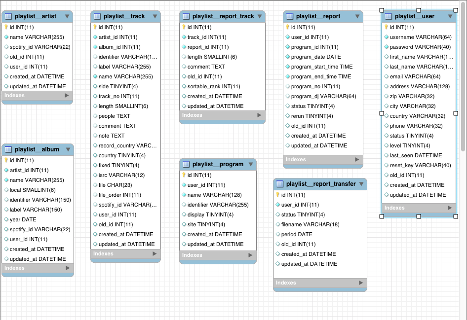

# Fullstack Harjoitustyö - Teemu Kostamo

## Kappaletietojen raportointisovellus radiokanavalle

Harjoitustyön aiheena on uusi kappaletietojen raportointisovellus Radio Helsingille. Sovelluksen käyttäjiä ovat kanavan djt jotka täyttävät raportteihin ohjelmissaan soittamansa kappaleet.

Kappaleita on mahdollista hakea raporttiin studion playout-softan soittologista. Mikäli kappaleet on soitettu muualta kuin playout-softasta, dj syöttää jokaisen biisin käsin. Käytössä on ennakoiva pikahaku, joilla haetaan tietokannasta jo entuudestaan soitettuja kappaleita. Mikäli kapplaetta ei löydy tietokannasta, dj syöttää kappaleen tiedot käsin. Tiedot tallennetaan tietokantaan ja avoinna olevaan raporttiin.

Kuukausittaiset raportit toimitetaan eteenpäin tekijänoikeusjärjestöille heidän vaatimassaan formaatissa. Linkki Gramexin raportointiohjeeseen [tässä](https://www.gramex.fi//wp-content/uploads/2018/11/raportointiohje_kaupalliset_radiot_1_7_20091.pdf)

## Toiminnallisuus

Käyttäjä kirjautuu sisään sovelluksen etusivulla. Kirjautuneille aukeavassa näkymässä aloitetaan uuden raportin täyttäminen syöttämällä raporttiin ohjelman päivämäärä, kellonaika, ohjelman nimi ja dj:n nimi. Tämän jälkeen syötetään ohjelmassa soineet kappaleet. Valmis raportti merkataan valmiiksi ja tallennetaan. "Demoversio" yksittäisen raportin näkymästä [täällä](https://student.labranet.jamk.fi/~M6242/harjoitukset/harjoitustyo/index.html)

Raportit -näkymässä käyttäjä pääsee selaamaan tekemiään raportteja. Raportit on mahdollista suodattaa päivämäärän ja tilan (valmis/keskeneräinen) mukaan.

Haku -näkymässä käyttäjä voi hakea tietoa kanvalla soineista biiseistä (esim kuinka monta kertaa kappale x on soinut tietyllä aikavälillä). Haku-sivu pitää sisällään Top-100 -kappaleiden listauksen tietyllä aikavälillä.

Omat tiedot -näkymässä käyttäjä voi muokata yhteystietojaan ja vaihtaa salasanan.

## Toiminnallisuus - admin

Admineilla perustoiminnallisuuksien lisäksi mahdollisuus selata ja muokata kaikkien käyttäjien kaikkia raportteja, lisätä tai poistaa käyttäjiä tai ohjelmia ja luoda tekijänoikeusjärjestöille lähetettävä siirtotiedosto yhden kuukauden kaikista raporteista. Admin voi monistaa olemassa olevia raportteja. Näin tehdään mikäli ohjelmia lähetetään uusintoina. Alkuperäisen lähetyksen raporttiin vaihdetaan päivämääräksi uusinnan päivämäärä.

## Kysymyksiä

### Biisitietokanta

Kanavan soittotapahtumat on tallennettu MySQL-tietokantaan noin vuoden 2000 alusta alkaen. Tietokannasta löytyy myös olemassaolevat käyttäjät ja heidän raporttinsa. Kannattaako uudessa sovelluksessa käyttää alkuperäistä tietokantaa vai luoda vanhasta uusi, esim MongoDB-tietookanta? Alla tietokannan taulut:

### Tietokannan siivoaminen

Vanhasta kannasta löytyy paljon esim duplikaattibiisejä, -artisteja ja -ohjelmia. Onko jotain "helppoa" keinoa näiden siivoamiseen?

### Miten tutkitaan löytyykö playlogista haettuja biisitietoja tietokannasta?

Kun playlogista haetaan kappaleita yksittäiseen raporttiin, täytyy selvittää löytyykö haettuja biisejä tietokannasta. Jos löytyy, niin ko. biisin riviin lisätään timestamp merkkaamaan soittokertaa. Mikäli kappaletta ei löydy, niin se lisätään uutena tietokantaan. Playlogista on saatavilla kaikki lisäykseen tarvittavat tiedot. Ideana siis se, että käyttäjä tekee raportin valmiiksi frontendissä. Vasta kun raportti on ajan tasalla, niin käyttäjä klikkaa "Tallenna" -nappia, ja vasta sitten tehdään tarvittavat tietokantaoperaatiot.

Kuulostaako järkevältä?

### Tarvittavat kirjastot

Mitä kirjastoja sovelluksessa tulisi käyttää? Backendissa ainakin Bcrypt, Body-Parser, Cors, Dotenv, Express, JWT, Sequelize?

### Redux vs hooks

Onko tämän kokoisessa sovelluksessa perusteltua käyttää Reduxia vai riittääkö state hooks? Stateen menisi siis tieto kirjautuneesta käyttäjästä, lista raporteista, raportin lista kappaleista, hakusivujen kappalelistat. Adminilla toki vähän enemmän kuin edellä mainitut.

### Käyttäjien autentikointi

Onko Fullstack-kurssilla opeteltu JSONWebToken -autentikointi soveltuva? Tietokannasta löytyy nykyisen järjestelmän käyttäjät, jotka täytyisi saada tuotua mukaan uuteen sovellukseen.

### Sequelize foreign key reference

Mysql workbenchissä ei näy foreign key -referenssejä tauluissa. Tulisiko nämä kuitenkin lisätä Sequelize-malleihin?
